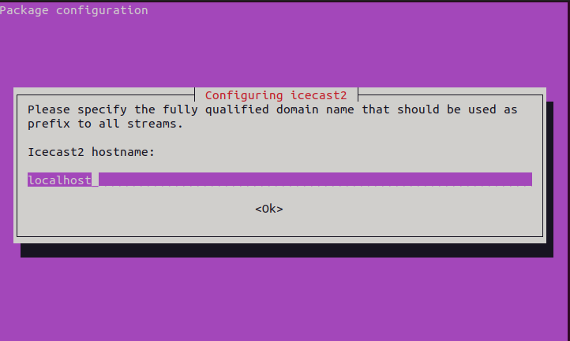
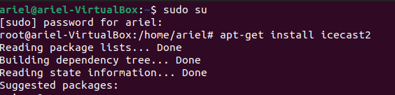
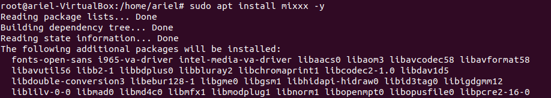
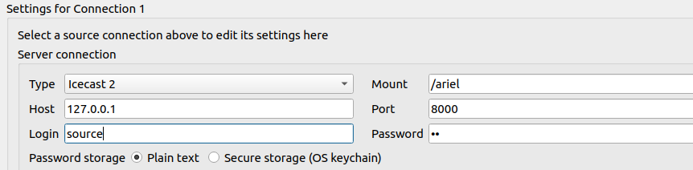
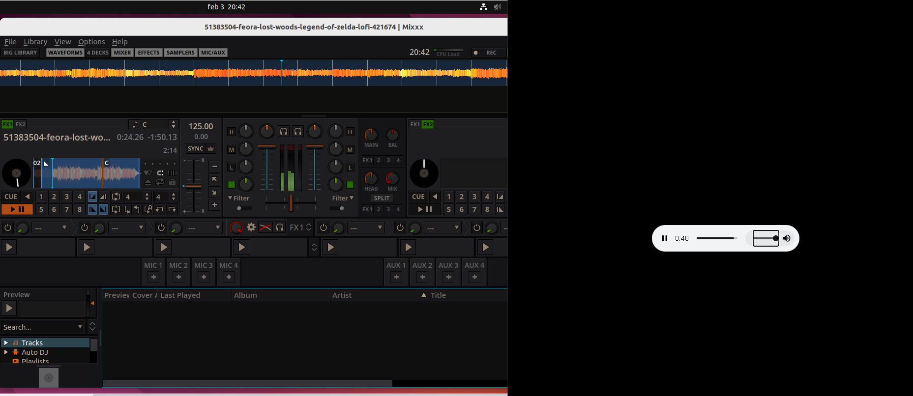

# Práctica de Radio Online (Icecast + Mixxx)

### Paso 0 --> Actualizamos el sistema y asignamos una ip fija.

### Paso 1 --> Instalamos icecast2 y lo configuramos.

Comando instalación --> sudo apt install icecast2

Configuracion de las preferencias de Mixxx --> anexo

### Paso 2 --> Comprobamos que el puerto 8000 mil este abierto para que el cliente pueda conectarse.

### Paso 3 --> Instalamos Mixxx y lo configuramos la emision.

sudo add-apt-repository ppa:mixxx/mixxx -y
sudo apt install mixxx -y

### Paso 4 --> Comprobamos que funciona el audio desde la url en otra máquina.

Desde la otra máquina, en este caso la maquina real, entramos en la url con la ip de la mv y con el puerto correspondiente y la carpeta /ariel en este caso y vemos como se reproduce perfectamente el audio del icecast2.

http://127.0.0.1:8000/video

## Anexo

