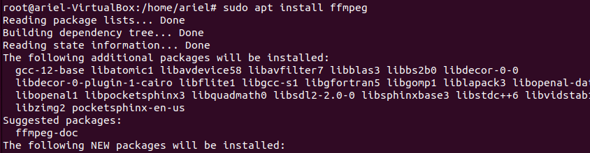
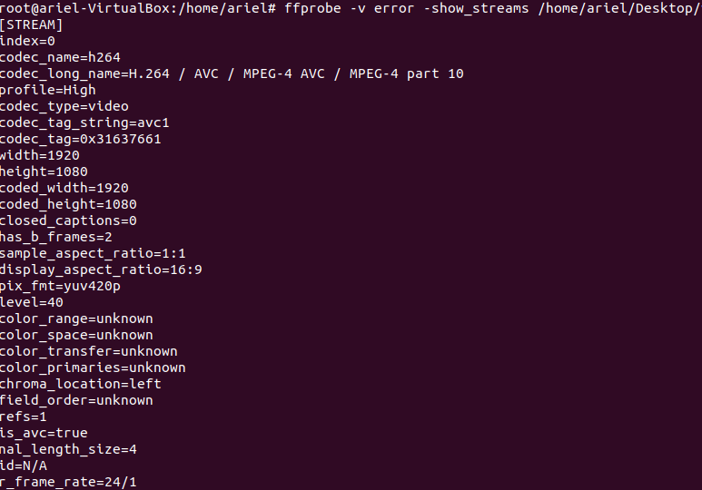
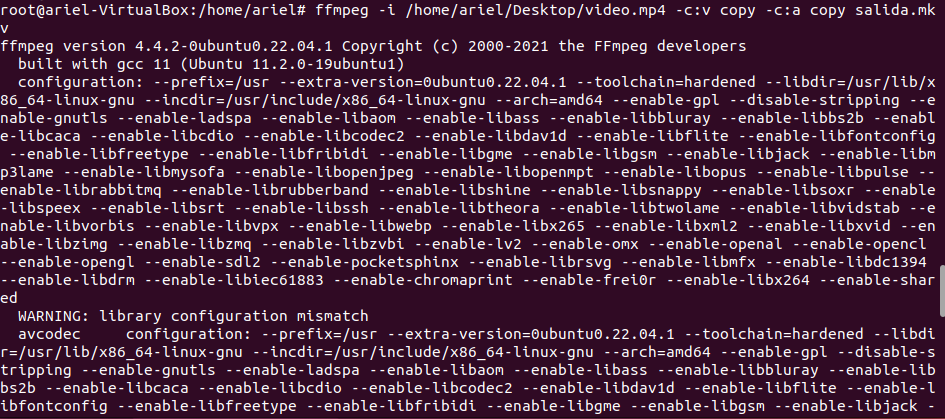
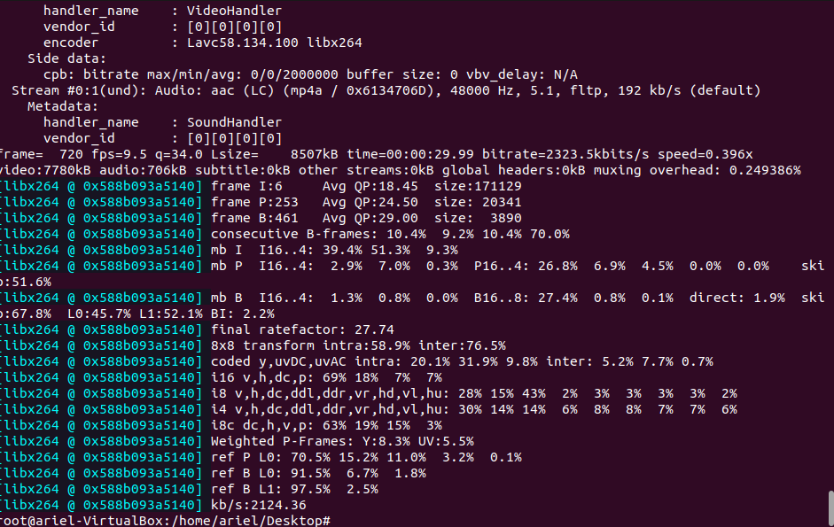
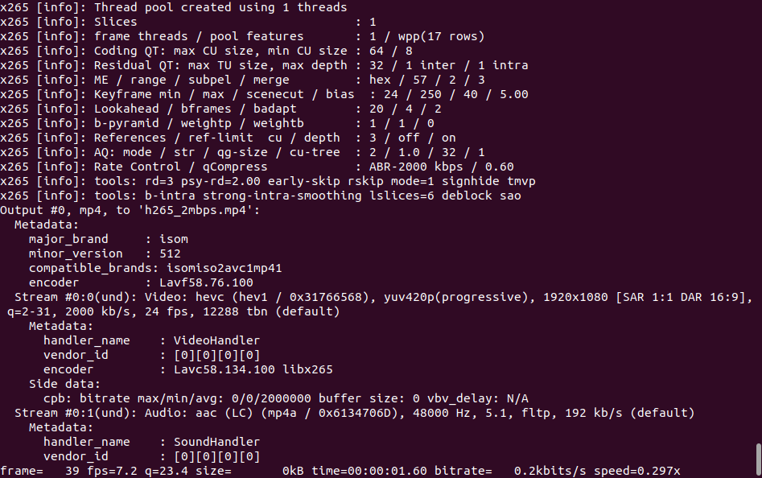

# Práctica de Vídeo (FFmpeg, códecs, remuxing, bitrate…)

### Paso 1 --> Instalar icecast2 y vlc

Comando instalación --> sudo apt install icecast2 vlc  

### Paso 2 --> Analizar el vídeo con ffprobe

ffprobe -v error -show_streams video.mp4  

### Paso 3 --> Remuxing: cambio de contenedor. De .mp4 a .mkv

ffmpeg -i original.mp4 -c:v copy -c:a copy salida.mkv  

a) ¿Ha cambiado el tamaño de forma significativa?  
No. El tamaño del archivo apenas cambia porque los datos de vídeo y audio se copian tal cual.  

b) ¿Ha habido carga de CPU?¿Ha tardado mucho?  
No. Como no hay recodificación FFmpeg solo reestructura el archivo.  
La CPU apenas trabaja y el proceso suele tardar menos de 1 segundo.   

### Paso 4 --> Cambio de códecs y comparación

Crear el fichero en H.264 con un bitrate de 2Mbps:  
ffmpeg -i original.mp4 -c:v libx264 -b:v 2M -c:a copy  
h264_2mbps.mp4  

Ahora hazlo en H.265 con el mismo bitrate:  
ffmpeg -i original.mp4 -c:v libx265 -b:v 2M -c:a copy  
h265_2mbps.mp4  

### Paso 5 --> Simulación de streaming con diferentes tipos de fichero.

Low (móvil) --> ffmpeg -i original.mp4 -c:v libx264 -b:v 400k -vf scale=-1:240 -c:a aac -b:a 64k   low_240p_400k.mp4  

Resolución 240p  
Bitrate: 400k  

High (fibra) --> ffmpeg -i original.mp4 -c:v libx264 -b:v 2M -vf scale=1920:1080 -c:a aac -b:a 128k   high_1080p_2M.mp4  

Resolución: 1080p  
Bitrate: 2Mbps  

Reproduce ambos vídeos a la vez. Pon pausa en una escena con mucho movimiento.  
● ¿Cuál de los dos presenta más "artefactos" (cuadraditos)?  
H.264 muestra más artefactos ya que HEVC es un códec más moderno y eficiente.  

● Si ambos tienen el mismo bitrate (2 Mbps), ¿pesan lo mismo los archivos finales?  
No tiene porque, aunque uses -b:v 2M el bitrate objetivo es 2 Mbps  
H.264 y H.265 no alcanzan exactamente el mismo bitrate real.  

### Preguntas finales:

**Almacenamiento: Si tu servidor tiene un disco de 500 GB, ¿cuántas horas de vídeo del perfil "HD" (2 Mbps) podrías alojar?**

Paso 1: Pasar 500 GB a bits  
1 GB = 10^9 bytes  
1 byte = 8 bits  
500 GB = 500 × 10^9 bytes  
500 × 10^9 bytes × 8 = 4 × 10^12 bits  

Paso 2: Usar el bitrate de 2 Mbps  
2 Mbps = 2 × 10 6 bits/s  
Tiempo en segundos = 4 × 10 12 bits 2 × 10 6 bits/s = 2 × 10 6 s  

Paso 3: Pasar segundos a horas  
Horas=2×106s3600s/h --> 555.6h  

Resultado: 556 horas de vídeo HD a 2 Mbps.  

**Red: Tienes una línea de 100 Mbps simétricos. ¿Cuántos usuarios podrían ver el perfil  
"Móvil" (400 kbps) simultáneamente antes de saturar el 80% de la línea?** 

Paso 1: Calcular el 80% de 100 Mbps  
100 Mbps × 0.8 = 80 Mbps  

Paso 2: Pasar 400 kbps a Mbps  
400 kbps = 0.4 Mbps  

Paso 3: Dividir el ancho de banda disponible entre el consumo por usuario  
Usuarios = 80 Mbps 0.4 Mbps = 200  

Resultado: 200 usuarios simultáneos con el perfil Móvil de 400 kbps.  

## Anexo

